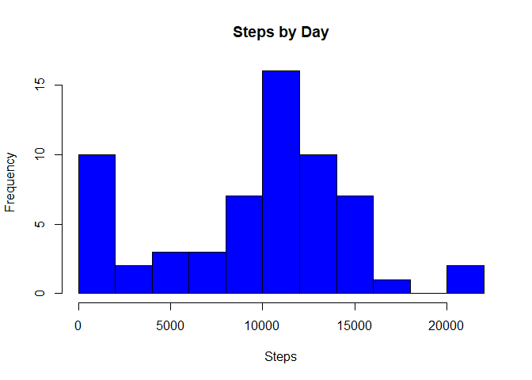
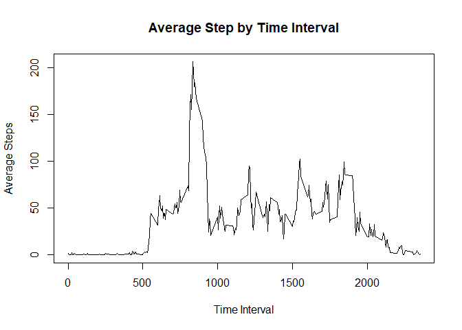
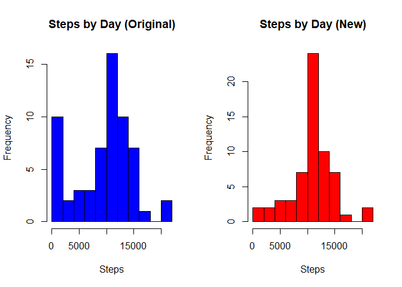
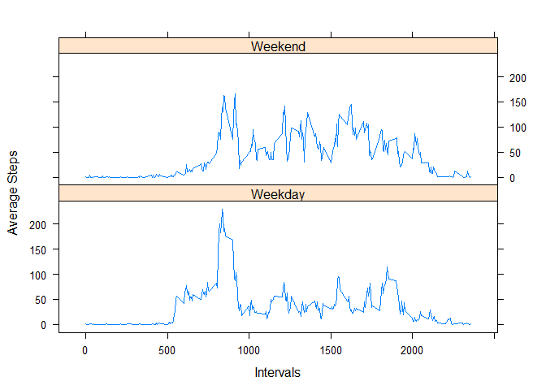

## Loading and preprocessing the data

The first thing we do is read in the CSV data into a data table:


```r
activity <- read.csv("activity.csv")
```

We then process the data by converting the character class 'date' field into a
date class type and then show the first few rows of data:


```r
activity$date <- as.Date(activity$date, format = "%Y-%m-%d")
head(activity)
```

```
##   steps       date interval
## 1    NA 2012-10-01        0
## 2    NA 2012-10-01        5
## 3    NA 2012-10-01       10
## 4    NA 2012-10-01       15
## 5    NA 2012-10-01       20
## 6    NA 2012-10-01       25
```

## What is mean total number of steps taken per day?

In this step we calculate the total number of step taken per day using the
'dplyr' package:


```r
daily <- activity %>% 
         group_by(date) %>% 
         summarize(total = sum(steps, na.rm = TRUE))
```

We will now plot a histogram (frequency distribution) of the steps taken per
day with 10 breaks:


```r
hist(daily$total, breaks = 10, 
         main = "Steps by Day", xlab = "Steps", col = "blue")
```

<!-- -->

We next calculate the mean and median of the steps taken per day:


```r
mean(daily$total)
```

```
## [1] 9354.23
```

```r
median(daily$total)
```

```
## [1] 10395
```

## What is the average daily activity pattern?

Next, we'll make a time series plot of the 5-minute interval (x-axis) and the 
average number of steps taken, averaged across all days (y-axis). We first 
calculate the average for each 5-minute interval and then plot it:


```r
avgs <- activity %>%
             group_by(interval) %>%
             summarize(avg = mean(steps, na.rm = TRUE))
plot(avgs, type = "l", main = "Average Step by Time Interval",
     xlab = "Time Interval", ylab = "Average Steps")
```

<!-- -->

We next display which 5-minute interval across all the days, on average, has
the maximum number of steps:


```r
avgs$interval[which.max(avgs$avg)]
```

```
## [1] 835
```

## Imputing missing values

First, we calculate the total number of rows for which the steps taken is NA:


```r
nasteps <- is.na(activity$steps)
sum(nasteps, na.rm = TRUE)
```

```
## [1] 2304
```

We will use the table of average steps by time interval we calculated earlier
to create a new table and fill in each NA value with this average for the 
specific time interval for which the step value is missing:


```r
newactivity <- activity
naindices <- which(is.na(newactivity$steps))
for (idx in naindices) {
     newactivity$steps[idx] = 
          as.integer(avgs[avgs$interval == newactivity$interval[idx], "avg"])
}
head(newactivity)
```

```
##   steps       date interval
## 1     1 2012-10-01        0
## 2     0 2012-10-01        5
## 3     0 2012-10-01       10
## 4     0 2012-10-01       15
## 5     0 2012-10-01       20
## 6     2 2012-10-01       25
```

We will now compute the total steps take by day with the new data and then plot
the original steps by day (with NAs) and the new steps by day (with NAs 
replaced by their average for that interval across the data set): 


```r
newdaily <- newactivity %>% 
            group_by(date) %>% 
            summarize(total = sum(steps))
par(mfrow = c(1,2))
hist(daily$total, breaks = 10, 
     main = "Steps by Day (Original)", xlab = "Steps", col = "blue")
hist(newdaily$total, breaks = 10, 
     main = "Steps by Day (New)", xlab = "Steps", col = "red")
```

<!-- -->

As we can see in the plots, by imputing the NAs, we significantly decrease
the frequency of low step days as well increasing the frequency of the days 
at the median.

Let's compare the orignial mean with the new mean: 


```r
mean(daily$total)
```

```
## [1] 9354.23
```

```r
mean(newdaily$total)
```

```
## [1] 10749.77
```

...and the orignial median with the new median: 


```r
median(daily$total)
```

```
## [1] 10395
```

```r
median(newdaily$total)
```

```
## [1] 10641
```

Both the mean and median number of steps per day increased when we inputed
missing values.

## Are there differences in activity patterns between weekdays and weekends?

We create a new factor variable assigning it whether the given day is a 
weekday (Monday - Friday) or a weekend (Saturday or Sunday):


```r
weekpart <- function(date) {
     if (weekdays(date) == "Saturday" | weekdays(date) == "Sunday") {
          "Weekend"
     }
     else {
          "Weekday"
     }
}
newactivity$weekpart <- sapply(newactivity$date, weekpart)
head(newactivity)
```

```
##   steps       date interval weekpart
## 1     1 2012-10-01        0  Weekday
## 2     0 2012-10-01        5  Weekday
## 3     0 2012-10-01       10  Weekday
## 4     0 2012-10-01       15  Weekday
## 5     0 2012-10-01       20  Weekday
## 6     2 2012-10-01       25  Weekday
```

We'll now compute the line plots for the average steps taken per 5-minute 
interval for both weekend days and weekdays:


```r
newavgs <- newactivity %>%
           group_by(weekpart, interval) %>%
             summarize(avg = mean(steps))
```

```
## `summarise()` has grouped output by 'weekpart'. You can override using the `.groups` argument.
```

```r
library("lattice")
xyplot(avg ~ interval | factor(weekpart), lwd = 1, type = "l", 
       data = newavgs, xlab = "Intervals", ylab = "Average Steps",
       layout = c(1,2))
```

<!-- -->
